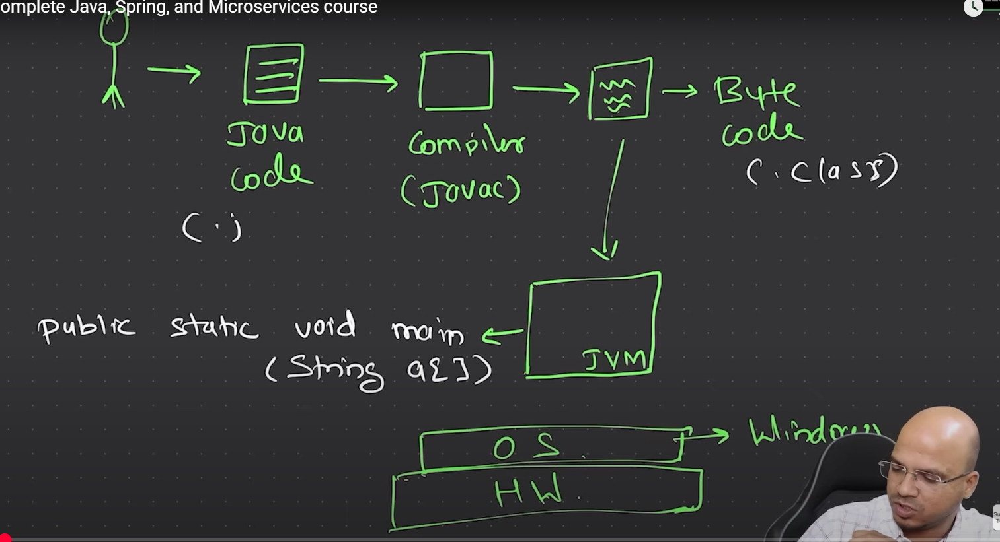
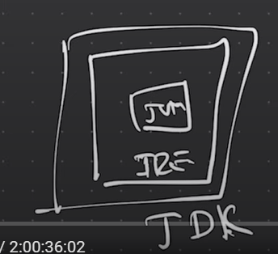

# Basics of Java

## Introduction
Java is a high-level, class-based, object-oriented programming language that is designed to have as few implementation dependencies as possible. It was created by James Gosling and first released by Sun Microsystems in 1995.

## Key Features
- **Platform Independence**: Java code is compiled into bytecode, which can run on any device equipped with a Java Virtual Machine (JVM).
- **Object-Oriented**: Java is based on the principles of objects and classes.
- **Robust**: Java has strong memory management, exception handling, and type checking mechanisms.
- **Secure**: Java provides a secure environment for developing and running applications.

## Bytecode
Bytecode is an intermediate code generated by the Java compiler. It is a set of instructions that can be executed by the JVM. Bytecode allows Java to be platform-independent, as the same bytecode can run on any platform with a compatible JVM.

## Basic Syntax
Here is a simple example of a Java program:

```java
public class HelloWorld {
    public static void main(String[] args) {
        System.out.println("Hello, World!");
    }
}
```

## Compilation and Execution
1. **Compilation**: The Java source code (`.java` file) is compiled by the Java compiler (`javac`) into bytecode (`.class` file).
2. **Execution**: The bytecode is executed by the JVM using the `java` command.

## Example
To compile and run the above example:

```sh
javac HelloWorld.java
java HelloWorld
```

This will output:
```
Hello, World!
```

## Conclusion
Java is a versatile and powerful programming language that is widely used in various domains, from web development to mobile applications. Its platform independence and robust features make it a popular choice among developers.

## How It Works


Java's architecture is designed to be simple, robust, and secure. The following diagram illustrates how Java code is compiled and executed:

1. **Source Code**: The programmer writes Java source code in a `.java` file.
2. **Compilation**: The Java compiler (`javac`) compiles the source code into bytecode, which is stored in a `.class` file.
3. **Execution**: The JVM loads the bytecode and translates it into machine code that can be executed by the host system.

This process ensures that Java programs can run on any device with a compatible JVM, making Java a platform-independent language.

## JRE, JVM, and JDK

### Java Runtime Environment (JRE)
The Java Runtime Environment (JRE) provides the libraries, Java Virtual Machine (JVM), and other components to run applications written in Java. It does not include tools for Java development, such as compilers or debuggers.

### Java Virtual Machine (JVM)
The Java Virtual Machine (JVM) is an abstract computing machine that enables a computer to run Java programs. It is responsible for converting bytecode into machine-specific code and executing it. The JVM provides platform independence by allowing the same bytecode to run on any platform with a compatible JVM.

### Java Development Kit (JDK)
The Java Development Kit (JDK) is a full-featured software development kit for Java. It includes the JRE, an interpreter/loader (Java), a compiler (javac), an archiver (jar), a documentation generator (Javadoc), and other tools needed for Java development. The JDK is essential for developing Java applications and applets.

### Summary
- **JRE**: Provides the runtime environment to run Java applications.
- **JVM**: Converts bytecode into machine code and executes it, providing platform independence.
- **JDK**: Includes the JRE and development tools for creating Java applications.

Understanding the differences between JRE, JVM, and JDK is crucial for Java developers, as each component plays a specific role in the development and execution of Java programs.

## Write Once, Run Anywhere (WORA)
Java's "Write Once, Run Anywhere" (WORA) capability allows developers to write code once and run it on any platform with a compatible JVM, ensuring platform independence and reducing the need for platform-specific modifications.


