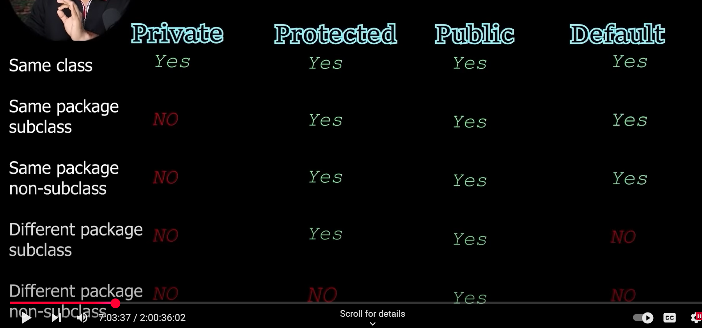

# Access Modifiers in Java
- Access modifiers are keywords that set the accessibility of classes, methods, and other members.
- They control the visibility of classes, methods, and variables to other classes.
- There are four access modifiers in Java:
  - **public**: The member is accessible from any other class.
  - **protected**: The member is accessible within its own package and by subclasses.
  - **default** (no modifier): The member is accessible only within its own package.
  - **private**: The member is accessible only within its own class.
- Access modifiers are important for encapsulation and data hiding.

