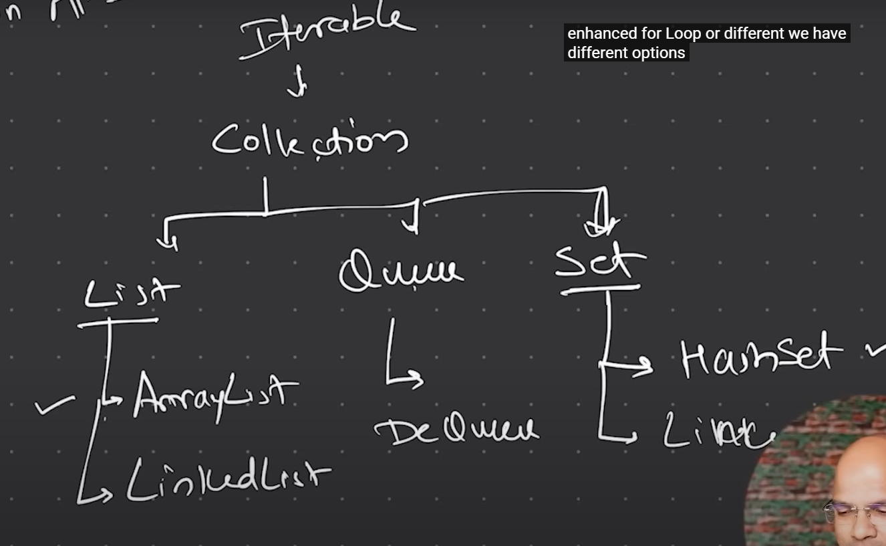

# Collection in Java

## What is a Collection?
- A collection is a data structure that can hold multiple values.
- It is a part of the Java Collections Framework.
- The Java Collections Framework provides a set of classes and interfaces for working with collections.
- It includes classes like `ArrayList`, `LinkedList`, `HashSet`, `TreeSet`, `HashMap`, and `TreeMap`.

## Types of Collections
- There are two main types of collections in Java:
  - **Collection**: This is the root interface in the collection hierarchy. It represents a group of objects known as elements.
  - **Map**: This is an object that maps keys to values. A map cannot contain duplicate keys, and each key can map to at most one value.
- The `Collection` interface has several subinterfaces, including:
    - **List**: An ordered collection (also known as a sequence). Lists can contain duplicate elements.
    - **Set**: A collection that does not allow duplicate elements. It models the mathematical set abstraction.
    - **Queue**: A collection used to hold multiple elements prior to processing. It is designed for holding elements prior to processing.
    - **Deque**: A double-ended queue that allows the insertion and removal of elements from both ends.
- The `Map` interface has several implementations, including:
    - **HashMap**: A hash table based implementation of the `Map` interface. It allows null values and the null key.
    - **TreeMap**: A red-black tree based implementation of the `Map` interface. It is sorted according to the natural ordering of its keys.
    - **LinkedHashMap**: A hash table and linked list implementation of the `Map` interface, with predictable iteration order.
    - **Hashtable**: A synchronized implementation of the `Map` interface. It does not allow null keys or values.
- The `Queue` interface has several implementations, including:
    - **PriorityQueue**: An unbounded priority queue based on a priority heap. It orders its elements according to their natural ordering or by a comparator provided at queue construction time.
    - **ArrayDeque**: A resizable array implementation of the `Deque` interface. It is not thread-safe and does not support capacity-restricted deques.
    - **LinkedList**: A doubly linked list implementation of the `List` and `Deque` interfaces. It allows null elements.

## Commonly Used Classes
- **ArrayList**: A resizable array implementation of the `List` interface. It allows duplicate elements and maintains insertion order.
- **LinkedList**: A doubly linked list implementation of the `List` interface. It allows duplicate elements and maintains insertion order.
- **HashSet**: A hash table implementation of the `Set` interface. It does not allow duplicate elements and does not maintain any order.
- **TreeSet**: A red-black tree implementation of the `Set` interface. It does not allow duplicate elements and maintains a sorted order.
- **HashMap**: A hash table implementation of the `Map` interface. It allows null values and the null key.
- **TreeMap**: A red-black tree implementation of the `Map` interface. It does not allow null keys and maintains a sorted order.
- **LinkedHashMap**: A hash table and linked list implementation of the `Map` interface. It maintains insertion order.
- **PriorityQueue**: An unbounded priority queue based on a priority heap. It orders its elements according to their natural ordering or by a comparator provided at queue construction time.
- **ArrayDeque**: A resizable array implementation of the `Deque` interface. It is not thread-safe and does not support capacity-restricted deques.
- **LinkedBlockingQueue**: A blocking queue backed by a linked node structure. It is thread-safe and supports capacity-restricted queues.

