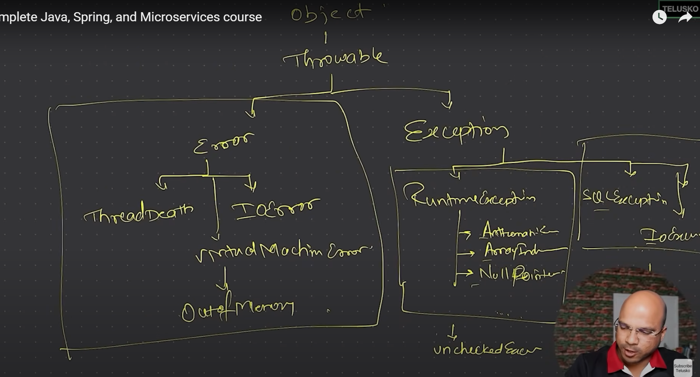

# Exception Handling in Java

## Types of Errors
1. **Compile-time Errors**: These are errors that occur during the compilation of the program. They can be syntax errors or type-checking errors.
2. **Runtime Errors**: These errors occur during the execution of the program. They can be caused by various factors such as invalid input, resource unavailability, etc.
3. **Logical Errors**: These errors occur when the program runs without crashing but produces incorrect results. They are often due to mistakes in the logic of the code.

## Exception Handling
Exception handling is a mechanism to handle *runtime errors* in a controlled manner. It allows the program to continue executing even when an error occurs, rather than crashing.
It provides a way to catch exceptions and take appropriate actions, such as logging the error, notifying the user, or attempting to recover from the error.

## Exception Hierarchy
- **Object**: The root class of the Java class hierarchy. All classes in Java are subclasses of `Object`.
- **Throwable**: The superclass of all errors and exceptions in Java. It has two main subclasses:
  - **Error**: Represents serious problems that a reasonable application should not try to catch. Examples include `OutOfMemoryError`, `StackOverflowError`, etc.
  - **Exception**: Represents conditions that a reasonable application might want to catch. It has two main subclasses:
    - **Checked Exceptions**: These are exceptions that are checked at compile-time. The programmer is required to handle these exceptions using try-catch blocks or declare them in the method signature using the `throws` keyword. Examples include `IOException`, `SQLException`, etc.
    - **Unchecked Exceptions**: These are exceptions that are not checked at compile-time. They are subclasses of `RuntimeException`. The programmer is not required to handle these exceptions, but it is a good practice to do so. Examples include `NullPointerException`, `ArrayIndexOutOfBoundsException`, etc.



## Throw in Java
The `throw` keyword is used to explicitly throw an exception in Java. It can be used to throw both checked and unchecked exceptions. The syntax for using `throw` is as follows:

```java
throw new ExceptionType("Error message");
```
### Example
```java
public class ThrowExample {
    public static void main(String[] args) {
        try {
            throw new Exception("This is a custom exception");
        } catch (Exception e) {
            System.out.println(e.getMessage());
        }
    }
}
```
### Output
```
This is a custom exception
```
## Throws in Java
The `throws` keyword is used in the method signature to declare that a method may throw one or more exceptions. It is used for checked exceptions that are not handled within the method. The syntax for using `throws` is as follows:

```java
public void methodName() throws ExceptionType1, ExceptionType2 {
    // method body
}
```
### Example
```java
import java.io.IOException;
public class ThrowsExample {
    public static void main(String[] args) {
        try {
            methodThatThrows();
        } catch (IOException e) {
            System.out.println("Caught IOException: " + e.getMessage());
        }
    }

    public static void methodThatThrows() throws IOException {
        throw new IOException("This is a custom IOException");
    }
}
```
### Output
```
Caught IOException: This is a custom IOException
```