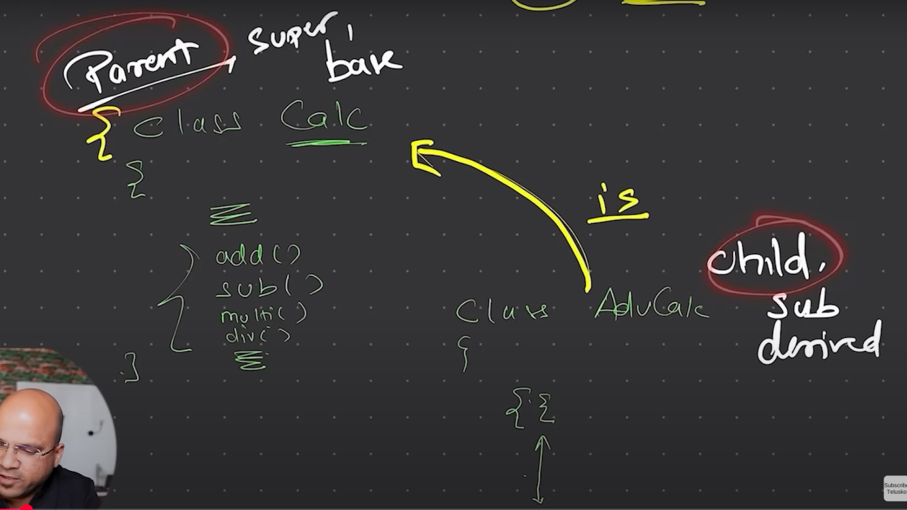

# Inheritance
- Inheritance is a mechanism in OOP that allows a class to inherit properties and methods from another class.
- It promotes code reusability and establishes a relationship between classes.
- The class that inherits is called the child class (or subclass), and the class being inherited from is called the parent class (or superclass).
- Inheritance can be single (one parent class) or multiple (multiple parent classes).

- You can use a class file to run inheritance in java.
For Example:
AdvancedCalculator extends Calculator
so you just need .class file of Calculator to run AdvancedCalculator.