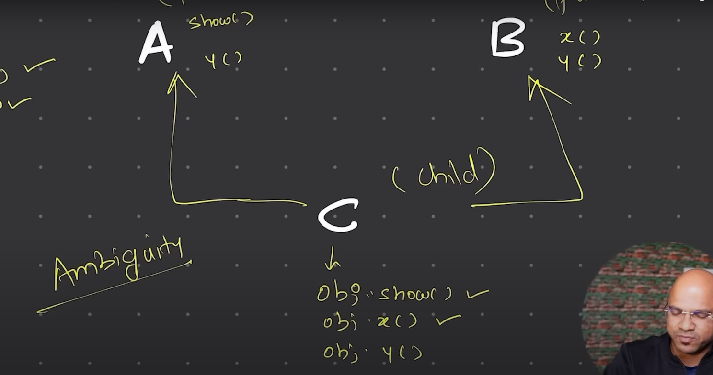

# Types of Inheritance in java
## - In Java, there are several types of inheritance:
- 1. Single Inheritance: A class inherits from one parent class.
- 2. Multilevel Inheritance: A class inherits from a parent class, which in turn inherits from another class.

- 3. Multiple Inheritance: A class inherits from multiple parent classes. (Not supported in Java directly, but can be achieved through interfaces.)

        **Why multiple inheritance is not supported in Java?

            - Diamond Problem: If two parent classes have a method with the same name, it can create ambiguity in which method to inherit.
            - Complexity: It can make the code more complex and harder to understand.
        
- 4. Hierarchical Inheritance: Multiple classes inherit from a single parent class.
- 5. Hybrid Inheritance: A combination of two or more types of inheritance.
