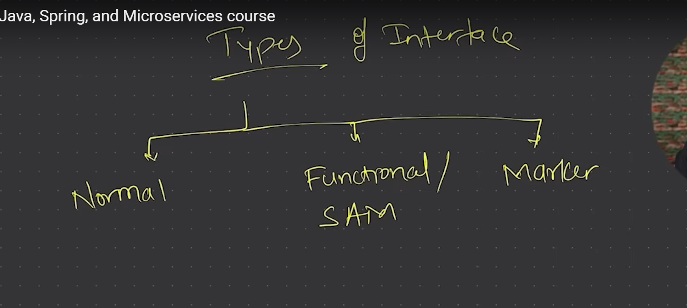

# Types of Interfaces in Java

## 1. Marker Interface
- An interface with no methods or fields.
- Used to indicate that a class possesses a certain property or behavior.
- Example: `Serializable`, `Cloneable`
- **Example**:
```java
public interface MarkerInterface {
    // No methods or fields
}
public class MyClass implements MarkerInterface {
    // This class is marked with MarkerInterface
}
```
## 2. Functional Interface
- An interface with exactly one abstract method.
- Can be used as the assignment target for a lambda expression or method reference.
- Introduced in Java 8.
- Example: `Runnable`, `Callable`
- **Example**:
```java
@FunctionalInterface
public interface FunctionalInterfaceExample {
    void singleAbstractMethod();
}
public class Main {
    public static void main(String[] args) {
        FunctionalInterfaceExample example = () -> System.out.println("Functional Interface Example");
        example.singleAbstractMethod();
    }
}
```
## 3. Single Abstract Method (SAM) Interface
- A type of functional interface with only one abstract method.
- Can have multiple default or static methods.
- Example: `Comparator`, `ActionListener`
- **Example**:
```java
@FunctionalInterface
public interface SingleAbstractMethodInterface {
    void performAction();
}
public class Main {
    public static void main(String[] args) {
        SingleAbstractMethodInterface action = () -> System.out.println("Performing action");
        action.performAction();
    }
}
```
## 4. Default Interface
- An interface that can have default methods (methods with a body).
- Introduced in Java 8.
- Allows adding new methods to interfaces without breaking existing implementations.
- Example: `List`, `Set`
- **Example**:
```java
public interface DefaultInterface {
    default void defaultMethod() {
        System.out.println("This is a default method");
    }
}
public class Main implements DefaultInterface {
    public static void main(String[] args) {
        Main obj = new Main();
        obj.defaultMethod(); // Calls the default method
    }
}
```
## 5. Static Interface
- An interface that can have static methods.
- Introduced in Java 8.
- Static methods can be called without creating an instance of the interface.
- Example: `Math`, `Collections`
- **Example**:
```java
public interface StaticInterface {
    static void staticMethod() {
        System.out.println("This is a static method");
    }
}
public class Main {
    public static void main(String[] args) {
        StaticInterface.staticMethod(); // Calls the static method
    }
}
```
## 6. Private Interface
- An interface that can have private methods.
- Introduced in Java 9.
- Private methods can be used to share code between default methods in the same interface.
- Example: `List`, `Set`
- **Example**:
```java
public interface PrivateInterface {
    private void privateMethod() {
        System.out.println("This is a private method");
    }
    
    default void defaultMethod() {
        privateMethod(); // Calls the private method
    }
}
public class Main implements PrivateInterface {
    public static void main(String[] args) {
        Main obj = new Main();
        obj.defaultMethod(); // Calls the default method which in turn calls the private method
    }
}
```
