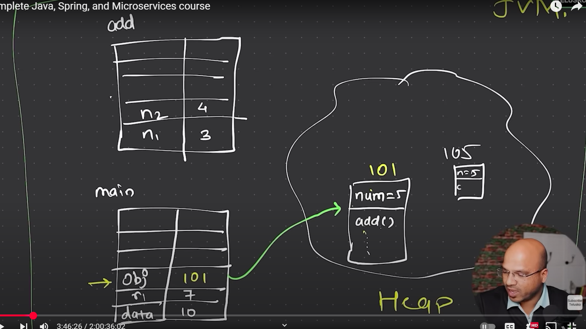

# Object Oriented Programming
- Object Oriented Programming (OOP) is a programming paradigm that uses objects and classes to structure code.
## Classes and Objects
- A class is a blueprint for creating objects. It defines the properties and methods that the objects created from the class will have.Class is basically a template for creating objects(designing a blueprint).
- An object is an instance of a class. It contains data and methods that operate on that data.

## How things work
Jdk ,Jre and jvm.
- Jdk is top layer and jre is middle layer and jvm is bottom layer.
- Jdk is a software development kit that provides tools for developing Java applications. It includes the Java compiler, Java runtime environment (JRE), and other tools.
- JRE is a runtime environment that allows Java applications to run. It includes the Java Virtual Machine (JVM) and libraries needed to run Java applications.
- JVM is a virtual machine that executes Java bytecode. It provides a runtime environment for Java applications and is responsible for converting bytecode into machine code that can be executed by the host operating system.

## Method Overloading
- Method overloading is a feature in Java that allows a class to have multiple methods with the same name but different parameters. This allows for more flexible and readable code.
- Method overloading is a *compile-time polymorphism*.
- Method overloading is achieved by changing the number of parameters or the type of parameters in the method signature.
- Method overloading is not possible by changing the return type of the method alone. The method signature must be different in order to overload a method.Example. if you have two methods with the same name and same parameters but different return types, it will result in a compile-time error.

## What happens in jvm when we call a method?
- When a method is called, the JVM looks for the method in the class and its superclasses. It checks the method signature (name and parameters) to find the correct method to execute.
- If the method is found, the JVM executes the method and returns the result. If the method is not found, a runtime exception is thrown.
- The JVM uses a stack to keep track of method calls and local variables. Each method call creates a new stack frame that contains the method's local variables and parameters. When the method returns, the stack frame is removed from the stack.
- The JVM also uses a heap to store objects and their data. When an object is created, memory is allocated on the heap for the object and its data. The JVM uses a garbage collector to manage memory and free up space when objects are no longer needed.
- The JVM uses a Just-In-Time (JIT) compiler to optimize the execution of Java bytecode. The JIT compiler compiles frequently used methods into native machine code for faster execution. This allows Java applications to run faster and more efficiently.
