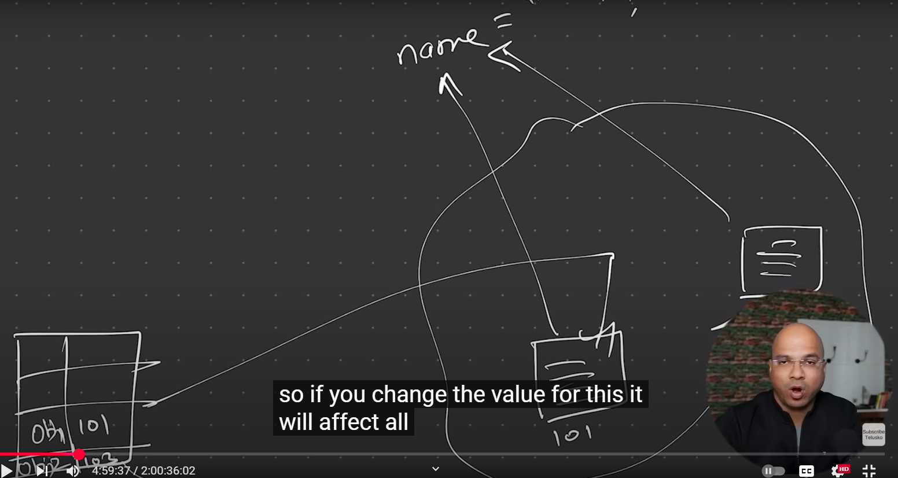

# Static in Java
Static in Java refers to a keyword used to indicate that a particular member (variable, method, block, or nested class) belongs to the class rather than any specific instance of the class. 

### Key Points:
1. **Static Variables**: Shared among all instances of a class. Changes made to the variable reflect across all instances.
2. **Static Methods**: Can be called without creating an instance of the class. They cannot access non-static members directly.
3. **Static Blocks**: Used for static initialization of a class. Executed when the class is loaded into memory.
4. **Static Classes**: Nested classes can be declared static, meaning they do not require an instance of the outer class.

## What Happens when you run OOPS code with static members in it?
- First the static members are loaded into memory.
- Then the main method is executed.
- The static members can be accessed directly using the class name without creating an instance of the class.
- First class loads and then objects are instantiated.