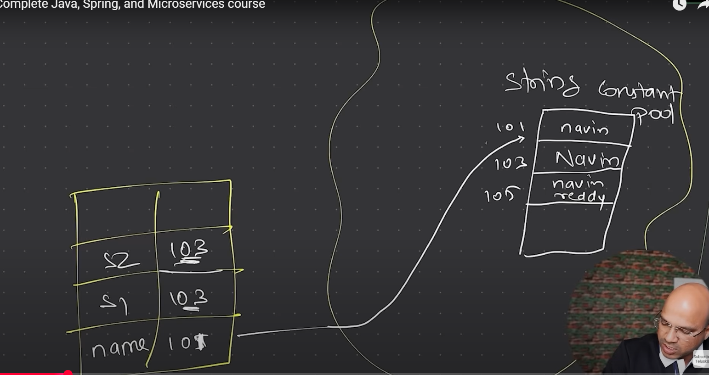

# String in Java
- String is a sequence of characters.
- String is immutable in Java.
- String is a class in Java.(not a variable)
- String is a reference data type.
- String is a final class in Java.
- String is a non-primitive data type.

## What happens in JVM when we create a string?
- When we create a string, it is stored in the String pool.
- String pool is a part of heap memory.
- String pool is a special memory area in the heap where Java stores string literals.
- String literals are created in the string pool.
- String literals are created when we use double quotes to create a string.
- String literals are created when we use the `new` keyword to create a string.
- String literals are created when we use the `String` class to create a string.
Example code
```java
String str1 = "Hello"; // String literal
String str2 = new String("Hello"); // String object
String str3 = new String("Hello"); // String object
```
In the above code, `str1` is a string literal and `str2` and `str3` are string objects.
- String literals are stored in the string pool.
- String objects are stored in the heap memory.
- String literals are stored in the string pool and are reused when we create a new string with the same value.
- String objects are created in the heap memory and are not reused.
- All str1,str2 and str3 are pointing to the same string literal "Hello" in the string pool.
- str2 and str3 are pointing to different string objects in the heap memory.
```java
String str1 = "Tejas"
str1 = str1 + "Trivedi" // str1 is now pointing to a new string object in the heap memory.
```
- In the above code, `str1` is now pointing to a new string object in the heap memory.
- The original string "Tejas" is still in the string pool and is not changed.
- The string "TejasTrivedi" is created in the heap memory and is not in the string pool.


## String Buffer and String Builder
- String Buffer and String Builder are mutable classes in Java.