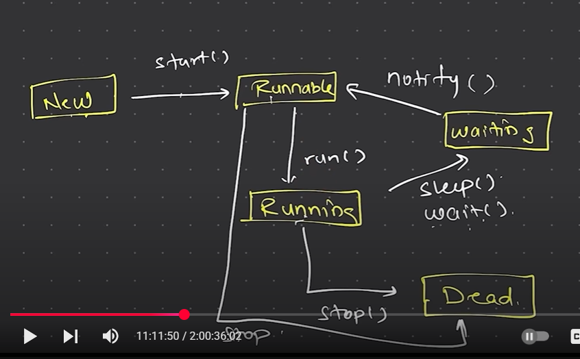

# Threads in Java

## What is a Thread?
A thread is a lightweight process that can run concurrently with other threads within the same process. Threads share the same memory space and resources, which makes them more efficient than separate processes. In Java, threads are used to perform multiple tasks simultaneously, improving the performance of applications.
Threads are used in various scenarios, such as:
- Performing background tasks (e.g., downloading files, processing data)
- Handling multiple user requests in server applications
- Implementing animations in GUI applications
- Running parallel computations
- Managing I/O operations without blocking the main thread
- Implementing real-time applications (e.g., games, simulations)

## Creating Threads in Java
In Java, there are two main ways to create threads:
1. **Extending the Thread class**: You can create a new class that extends the `Thread` class and override its `run()` method. This method contains the code that will be executed when the thread is started.

```java
class MyThread extends Thread {
    public void run() {
        // Code to be executed in the thread
        System.out.println("Thread is running");
    }
}
public class Main {
    public static void main(String[] args) {
        MyThread thread = new MyThread();
        thread.start(); // Start the thread
    }
}
```
2. **Implementing the Runnable interface**: You can create a new class that implements the `Runnable` interface and override its `run()` method. Then, you can create a `Thread` object and pass the `Runnable` instance to it.

```java
class MyRunnable implements Runnable {
    public void run() {
        // Code to be executed in the thread
        System.out.println("Thread is running");
    }
}
public class Main {
    public static void main(String[] args) {
        MyRunnable runnable = new MyRunnable();
        Thread thread = new Thread(runnable);
        thread.start(); // Start the thread
    }
}
```

## Important Methods of the Thread Class
- `start()`: Starts the thread and calls the `run()` method.
- `run()`: Contains the code to be executed by the thread.
- `sleep(long millis)`: Causes the current thread to sleep for the specified number of milliseconds.
- `join()`: Waits for the thread to die (i.e., finish execution).
- `interrupt()`: Interrupts the thread, causing it to stop if it is currently blocked or sleeping.
- `isAlive()`: Checks if the thread is alive (i.e., has been started and has not yet died).
- `setPriority(int priority)`: Sets the priority of the thread (1 to 10).
- `getPriority()`: Returns the priority of the thread.

## Thread Precautions
- Make sure to handle exceptions properly in the `run()` method to avoid crashing the thread.
- Avoid using `Thread.stop()` as it can leave shared resources in an inconsistent state.
- Use `Thread.sleep()` and `Thread.join()` carefully to avoid deadlocks and performance issues.
- Be cautious when sharing resources between threads to avoid data inconsistencies.
- If extending the `Thread` class, ensure that the class is not final, as it cannot be subclassed and the `run()` method cannot be overridden.

